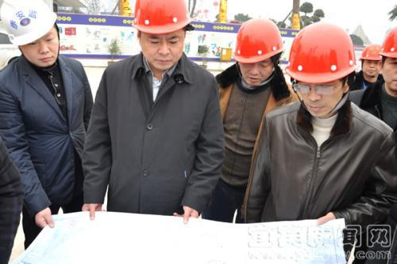
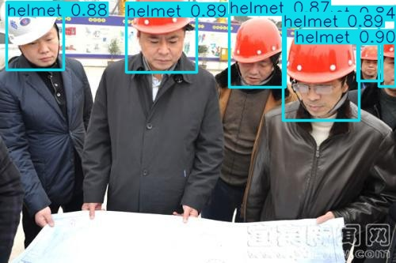
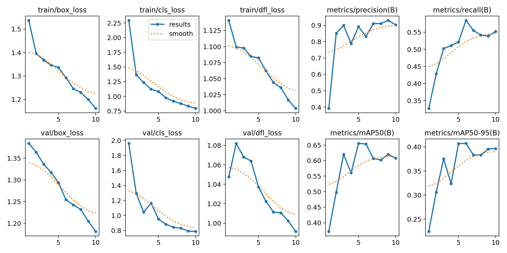
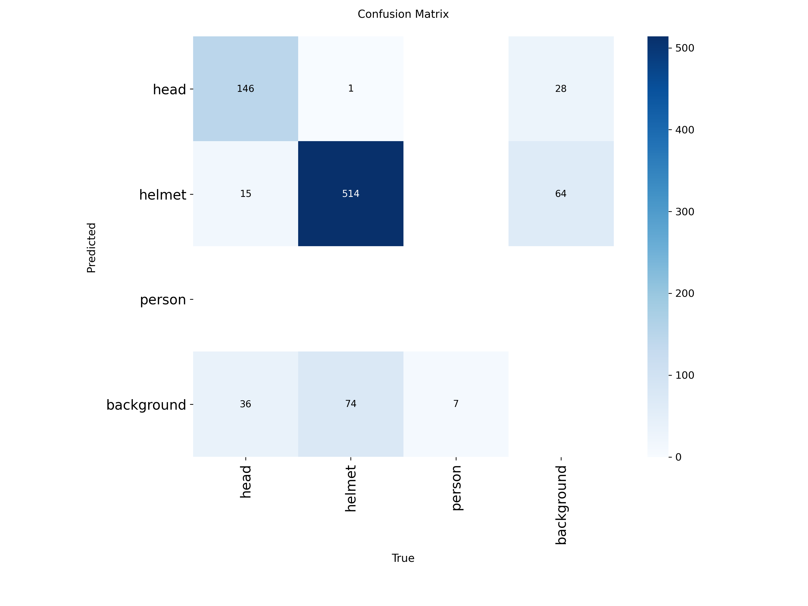
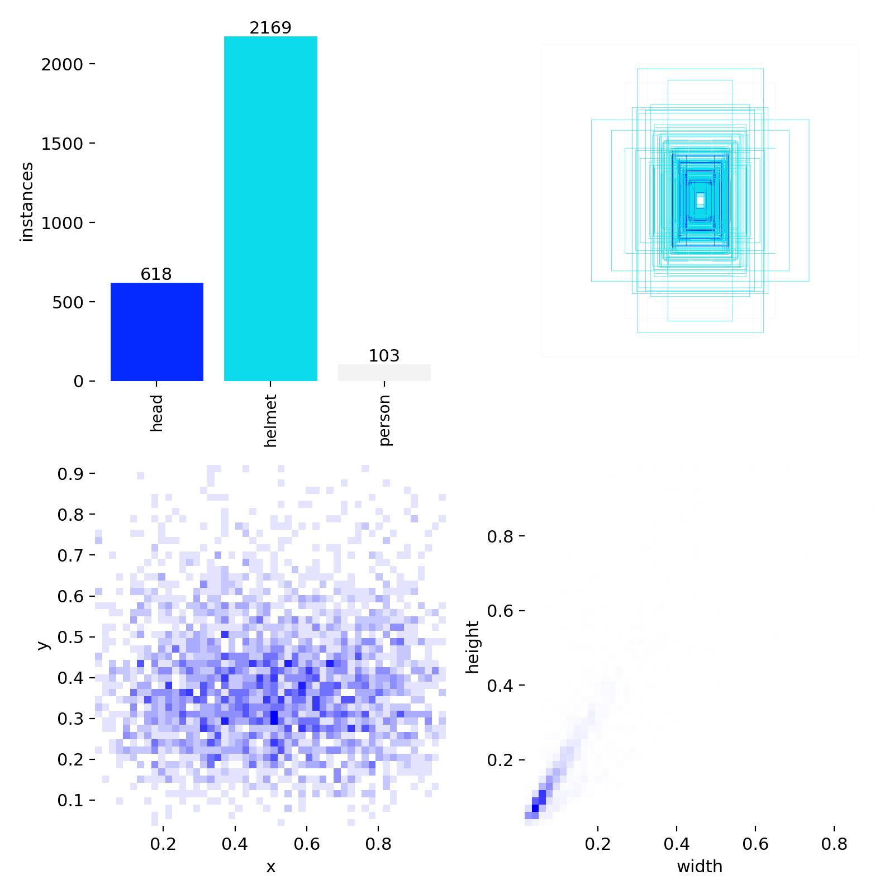

# Hard Hat Detection with YOLOv8

A YOLOv8-based computer vision project for detecting hard hats in construction environments using Roboflow and Google Colab.

## Overview

This project detects helmet-related safety conditions in construction images using a lightweight YOLOv8 model.  
It was built as an academic computer vision project and includes the training notebook, evaluation artifacts, sample predictions, and a trained model for inference.

## Dataset

The model was trained using the **Hard Hat Workers** dataset from Roboflow Universe.

A reduced subset of **1000 images** was used to make training faster in Google Colab:

- **800** training images
- **200** validation images

Dataset source: Hard Hat Workers Dataset from Roboflow Universe by `joseph-nelson` (Public Domain).

## Model

The project uses **YOLOv8n** with the following training setup:

- `epochs = 10`
- `imgsz = 416`
- `batch = 8`

A trained weight file is included in the repository:

```text
models/helmet.pt
```

## Technologies Used

- Python
- YOLOv8
- Ultralytics
- Roboflow
- Google Colab
- Computer Vision
- Object Detection

## Quick Start

### Run inference with the included model
1. Open `hard_hat_detection_yolov8.ipynb` in Google Colab.
2. Load `models/helmet.pt`.
3. Upload or select a test image.
4. Run the inference cells.
5. Review the generated prediction output.

### Train from scratch
1. Open `hard_hat_detection_yolov8.ipynb` in Google Colab.
2. Install dependencies.
3. Download the dataset using your own Roboflow API key.
4. Generate the 1000-image subset.
5. Create `data.yaml`.
6. Train the YOLOv8n model.
7. Validate and review the results.

## Results

The repository includes key training and evaluation artifacts:

- training curves
- confusion matrix
- label distribution
- sample input and prediction output

These artifacts show that the model performs best on the `helmet` and `head` classes, while `person` is the weakest class due to dataset imbalance.

## Example Output

### Sample Input


### Sample Prediction


## Training Artifacts

### Training Curves


### Confusion Matrix


### Labels Distribution


## Notes

- Do not upload API keys or private tokens.
- Do not upload the full dataset or temporary Colab outputs.
- Keep the notebook clean before publishing.
- The included `helmet.pt` allows direct inference without retraining.
